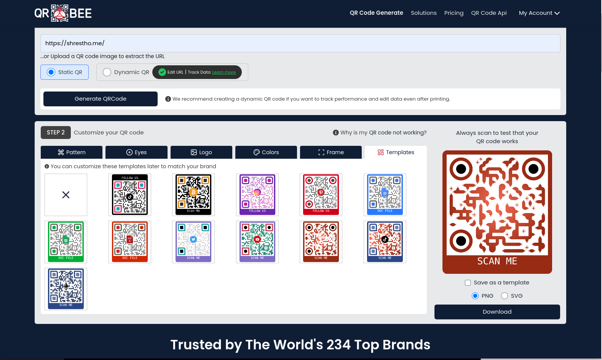
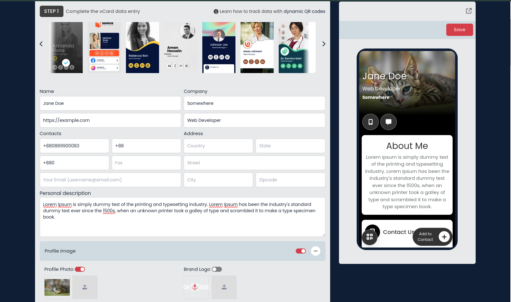
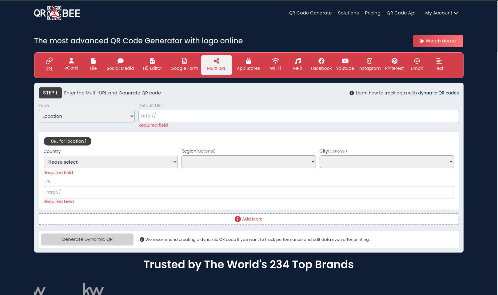
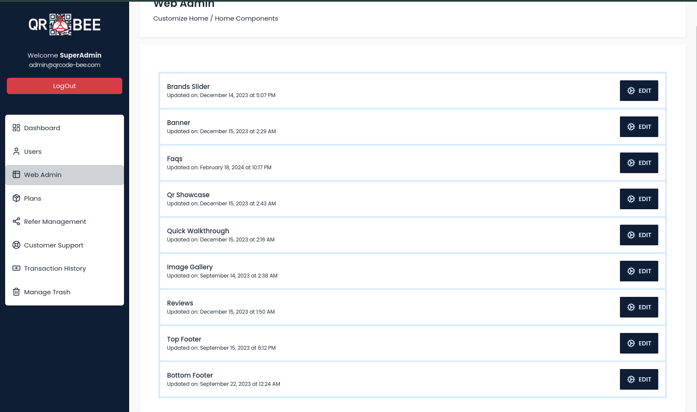
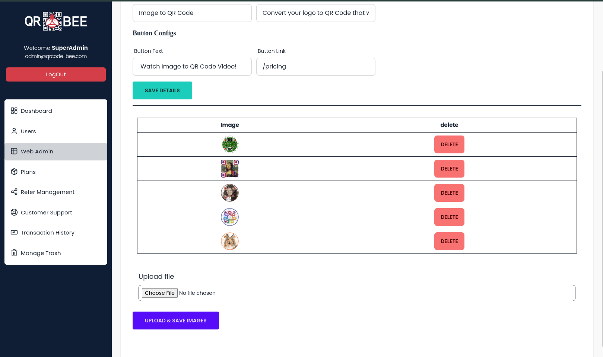
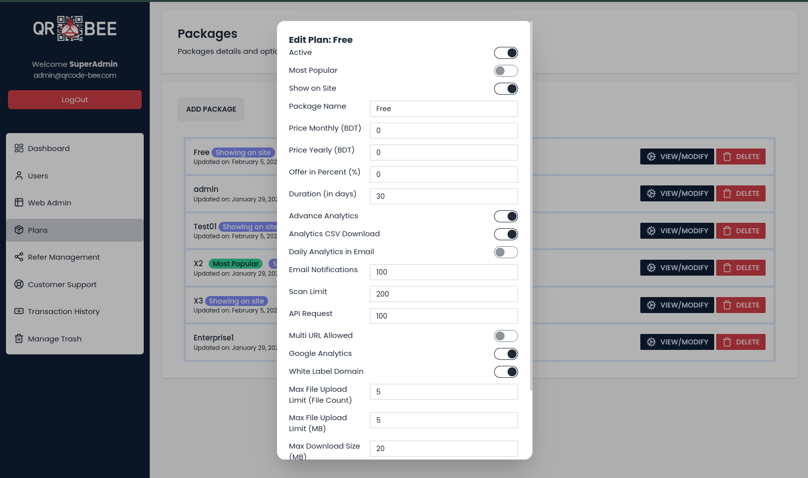
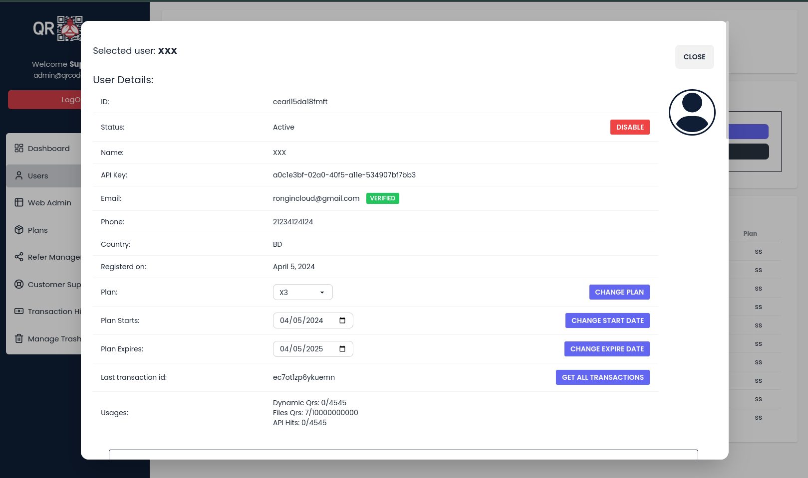
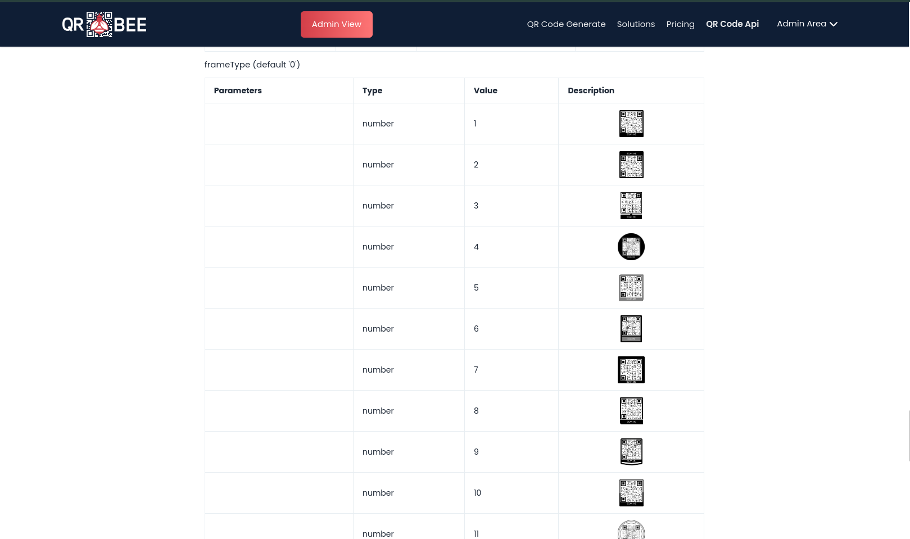

## Project Intro

QRCode-Bee is a microservice based scalable solution for customizer qr, vcard generation consisting sass application. This system is built with SvelteKit, Express, Golang, Pocketbase and other technologies. This project has been developed with collaboration with Ahsan Hasib Koushik for a tech company based in Bangladesh. The whole system, from system design to deployment was done following the DevOps methedology. While doing the project, we modified the qr library using jsdom and canvas that helped us create apis for generations. Web application of this project, the frontend service, consists of 15+ modules for user along with payment and other miscellaneous features and capable of providing static and dynamic qr codes for each. Bulk qrcode, file manager, analytics, refer and earn, trash  are some other user specific features. This system also provides api for end user and agencies to use this services of this application.

## Screenshots

Some screenshots of the project due to preview url is not available. 

*QRCode Generation & Customizations*

*VCard Customization and Dynamic QR Generation*

*Dynamic QR Generation with Multi URL Rules*

*Admin Panel - Main Site Customization Options*

*Admin Panel - Main Site Customization Options: Image Gallery*

*Admin Panel - Plans Customization*

*Admin Panel -  User Update*

*User API Customization*
