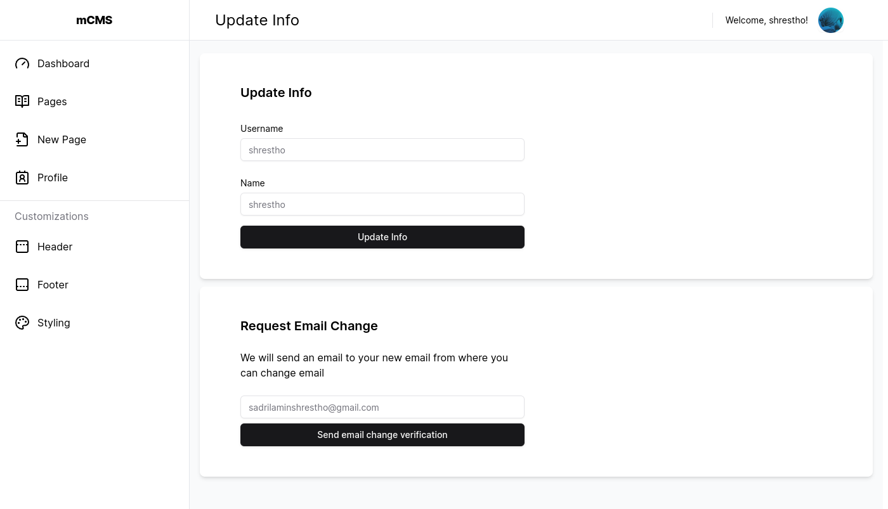

#### Preview & Links
Preview 1: https://p471.vercel.app/

Preview 2: https://minimal-cms.vercel.app/

Github Repo Link: https://github.com/shrestho0/minimal-cms

# Intro

mCMS (minimal content management system) is an application where a user can create their desired webpages with built in styling and has the facility to serving those webpages. This project was done as my university project for a course. This is available with two different tech stacks: `SvelteKit-PocketBase` version and `SvelteKit-SpringBoot` version.
 

## Screenshots

*Home page*

*Home page 2*

*User Panel: Header Customizations*

*User Panel: Update info, email*

*User Panel: Customize Styling*

*User Panel: Create/Modify Pages*

*Public page preview*
