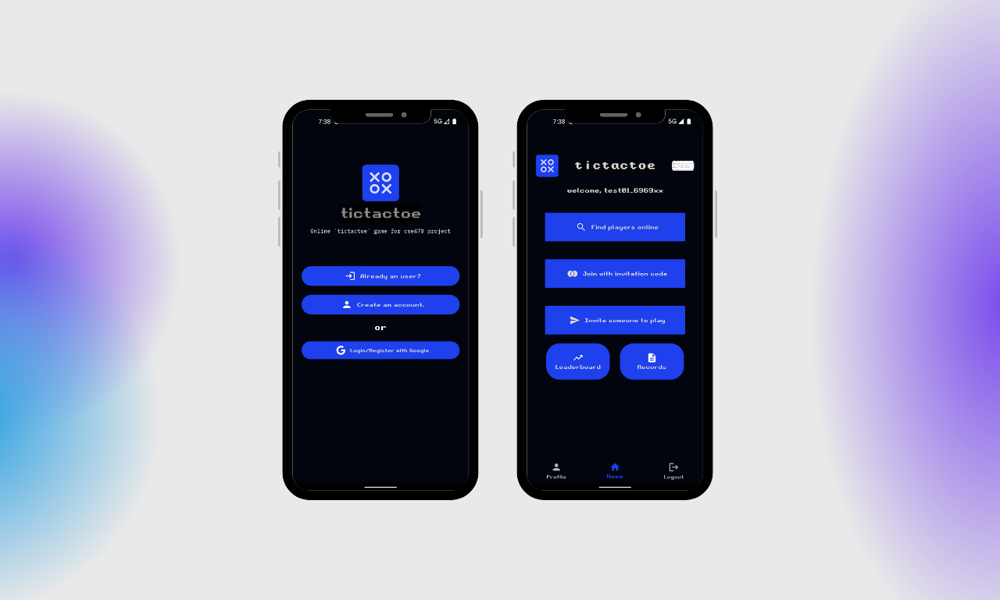
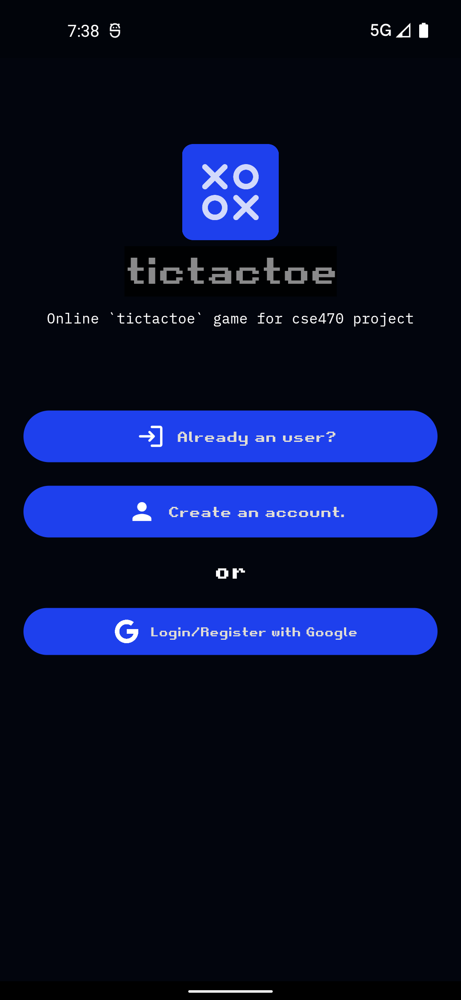
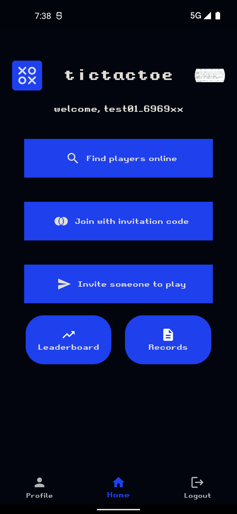
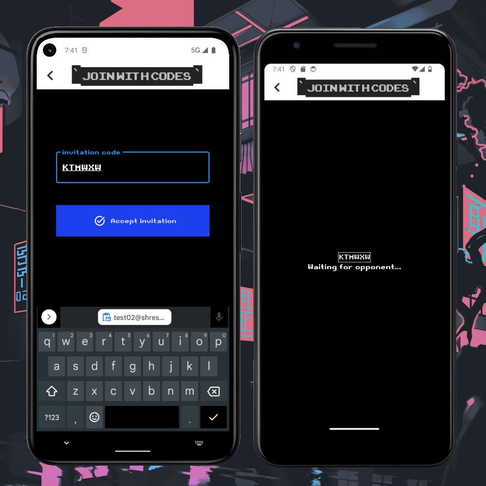
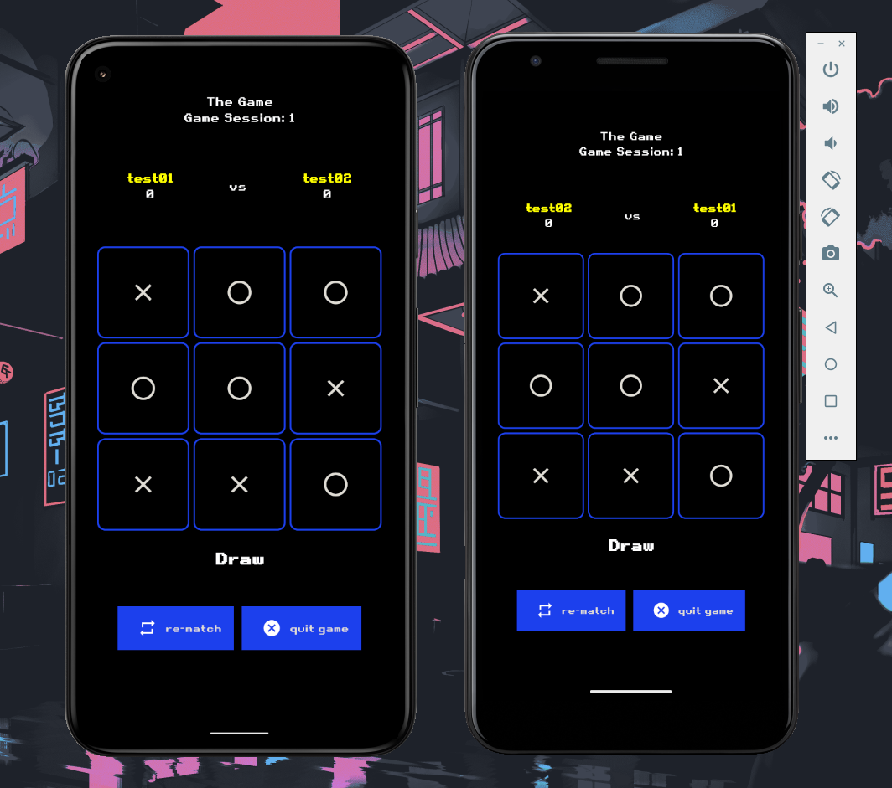
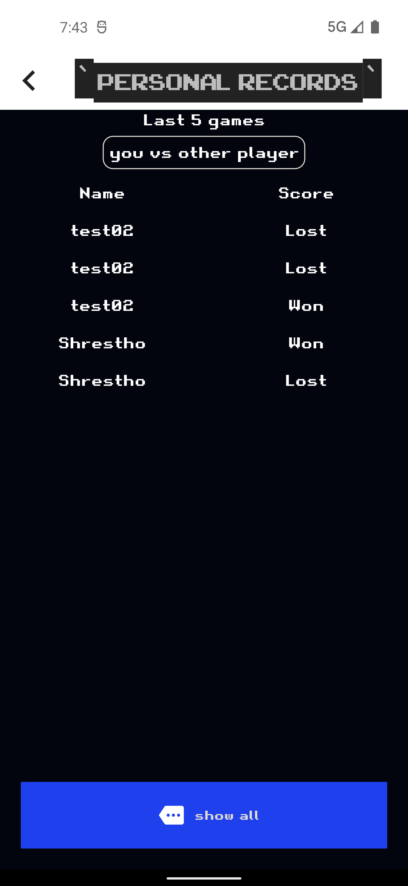
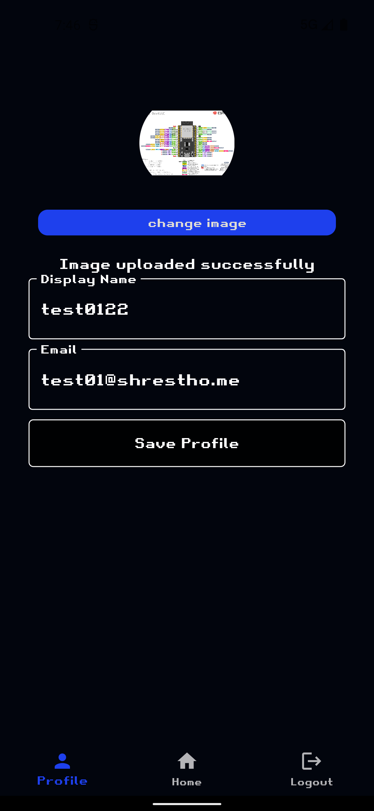

Github Repo URL: https://github.com/shrestho0/tictactoe-flutter

## Intro
Two player tictactoe game for my university course named "Mobile Application Development" (BRACU CSE489), developed using Flutter and Firebase services. This project includes:

- Login System (User authentication, Google oAuth Authentication, User Profile, User photo)
- Invitation (User can invite, User can join with invitation code)
- Online Game (Find and play with online player)
- Personal Game Records
- Leaderboard

## Screenshots

*Authentication Screen*

*Logged in Screen*

*Invitation and Game acceptance Screens*

*Game Playing Screens*

*Leaderboard Screen*

*Personal Game Record Screen*

*User Profile Screen*

*User Profile Edit Screen*
